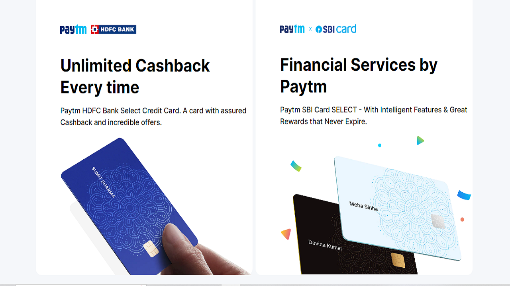
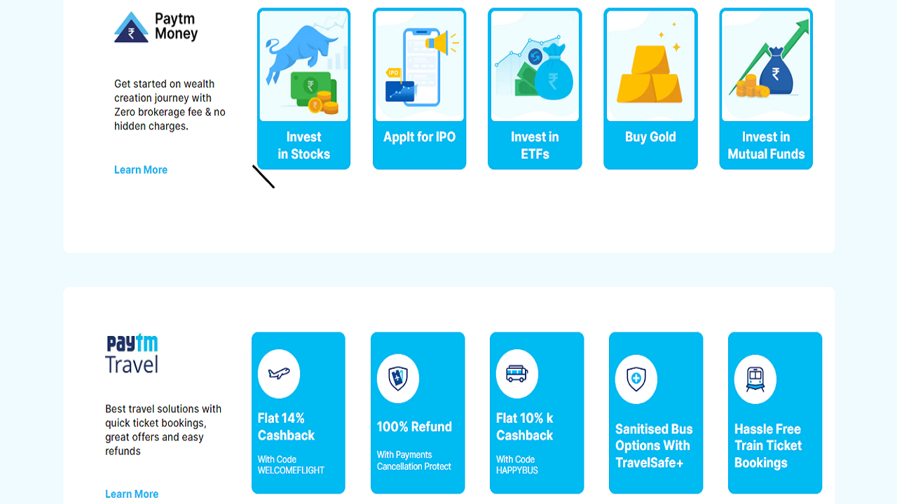

# Project-1:  **Paytm Clone**
# Technology Used :   

##  **About** :- 
During my journey to learn Tailwind CSS, I have tried to create a ***Paytm website clone*** completely using Tailwind Classes. All the CSS part is written in html file.
Throughout the process of building, I have learned so may things about different classes provided by tailwind. With the help of tailwind the website building process became so smooth because we are writing all the codes in one file without creating a CSS file.

## [***Project-live-Link-->***](https://paytmusingtailwind.netlify.app/) 

##  **Website Preview-->**

## Thank you for visiting.. also check-out my next Projects & please share your valuable Feedback 👍👍   
